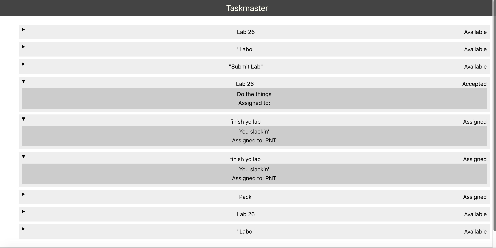

# TaskMaster

This App is the front end for the [Taskmaster API](https://github.com/Paula9t9/taskmaster). You can use it to see all the tasks in the Taskmaster database. 

Coming Soon: Be able to edit, add, and delete tasks as needed. 

## Features:

Visit the [deployed homepage](https://master.d14g9ef0hd7bcb.amplifyapp.com/) to see a list of all tasks currently in the database. 

## Screenshot: 

